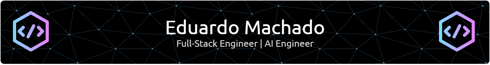

###

  

###

# Hi, I'm Eduardo Machado 👋

I'm a senior full-stack engineer and solutions architect based in Curitiba, Brazil 🇧🇷.

For the past 9 years, I've built enterprise backend systems and applied AI pipelines for hospitals and healthcare networks. Right now, I'm completing graduate studies in Applied Generative AI at UTFPR while building production GenAI tooling.

---

### What I work on

- **Applied AI & LLMs:** RAG pipelines, LangChain, and LangGraph workflows in Python.
- **Enterprise backends:** Microservices, RESTful APIs, SOAP services, and Docker deployments.
- **HealthTech systems:** Brazilian healthcare protocols (TISS), electronic medical records, RFID automation, and digital certification.
- **Academic research:** Graduate work in Applied Generative AI at UTFPR (2026-2028).

---

### Selected milestones

- **Sucesu-PR 2025 award:** Received the "Empresa Case Inovador" award for an electronic medical records pipeline built with Python, LangChain, and RAG.
- **Hospital platforms:** Architected core clinical systems for Hospital Erasto Gaertner, Sugisawa, Costantini, and Cruz Vermelha Paraná with zero-downtime reliability.
- **Hardware & domain integrations:** Deployed self-service totens, RFID badge tracking, SOAP interfaces, and official TISS protocol compliance.
- **Research fellowship:** Published research on sentiment analysis and educational game development through CNPq and Fundação Araucária.

---

### Tech stack

| Category | Tools & technologies |
| :--- | :--- |
| **AI & LLMOps** | Python, LangGraph, LangChain, RAG, LLMOps |
| **Backend & architecture** | Python, Javascript, PHP, REST APIs, SOAP, Microservices, Docker |
| **HealthTech & enterprise** | TISS Protocol, Medical Record Processing, RFID, Digital Certification |
| **DevOps & tooling** | Docker, CI/CD, Git, Linux |

  
  
  
  
  
  
  
  
  
  
  
  
  
  
  
  
  
  
  
  
  
  
  
  
  
  
  
  
  
  
  
  
  
  
  
  
  
  
  
  
  
  
  
  
  
  
  

---

  
  

  
---

### Get in touch

- **LinkedIn:** [linkedin.com/in/eduardo-felipe-machado](https://linkedin.com/in/eduardo-felipe-machado)
- **Email:** [eduardofelipemachado93@gmail.com](mailto:eduardofelipemachado93@gmail.com)
- **Location:** Curitiba, Paraná, Brazil 🇧🇷 (open to remote roles worldwide)
